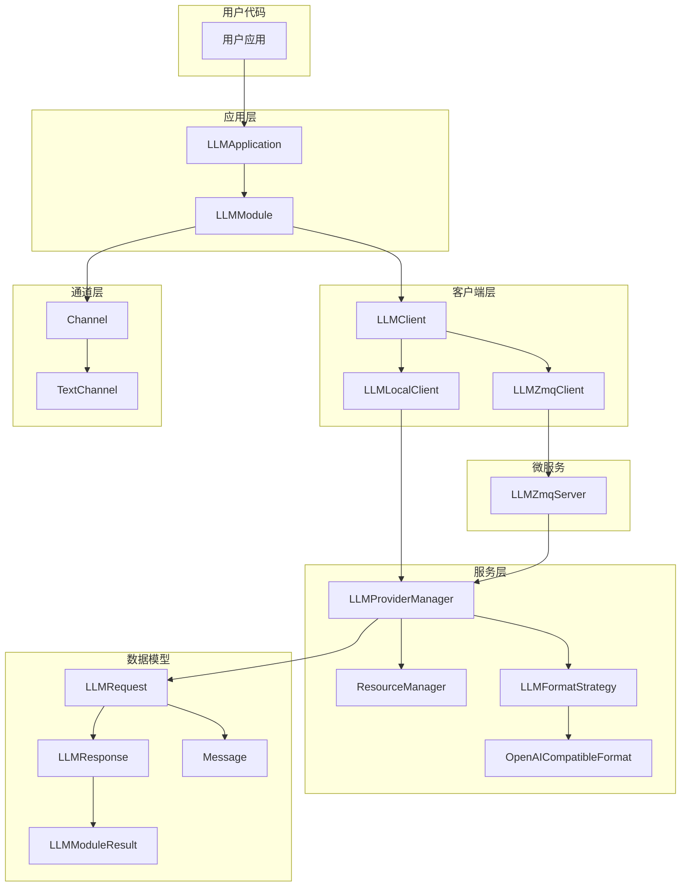
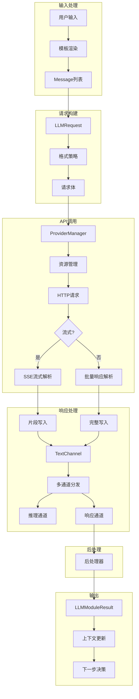
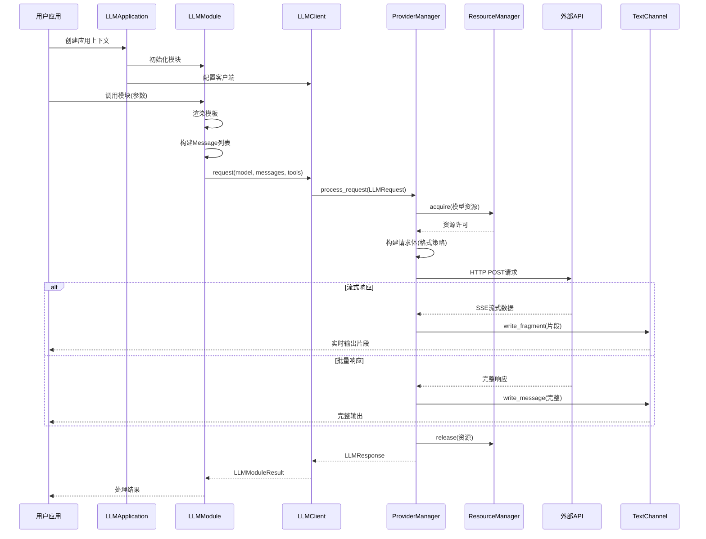

# aitoolman - 可控、透明的LLM应用框架

## 项目介绍
aitoolman 是一个面向开发者的LLM（大语言模型）应用框架，旨在解决现有框架的**供应商锁定、流程不清晰、调试困难**等痛点。框架将AI定位为“工具人”，强调**用户直接控制所有提示词、数据流、控制流**，帮助开发者快速构建稳定、可调试的LLM应用。

### 设计理念
1. **AI是工具人**：AI应像“985实习生”一样，执行明确指令，而非自主决策。
2. **流程可控**：所有程序逻辑由用户代码主导，**无意外操作、无隐藏提示词**，LLM也无自主权。
3. **数据流透明**：用户可自定义所有发往LLM的数据，充分利用各提供商特色功能。
4. **提示词模板化**：将提示词在固定的地方封装为可复用模板，避免提示词散落各处。

### 核心优势
- **供应商无关**：直接带入HTTP头和自定义选项，可抽象请求/响应格式，轻松切换供应商。
- **模块化设计**：组件职责单一，易于测试和替换。
- **流式支持**：通过`Channel`实现实时数据传输（如思考过程、响应片段）。
- **工具调用**：支持LLM工具调用，作为流程控制机制（如用调用A工具代表走A流程；或在需要调用工具时暂停，等待用户确认）。
- **微服务支持**：可将LLM调度器作为独立服务，统一资源管理和审计日志。

## 项目结构设计
### 数据流顺序

用户输入 → LLMApplication → LLMModule → LLMClient → LLMProviderManager → 
LLMFormatStrategy → HTTP API → 响应解析 → 后处理 → 通道输出 → 用户接收

### 类调用关系图

### 数据流图

### 数据流时序图

