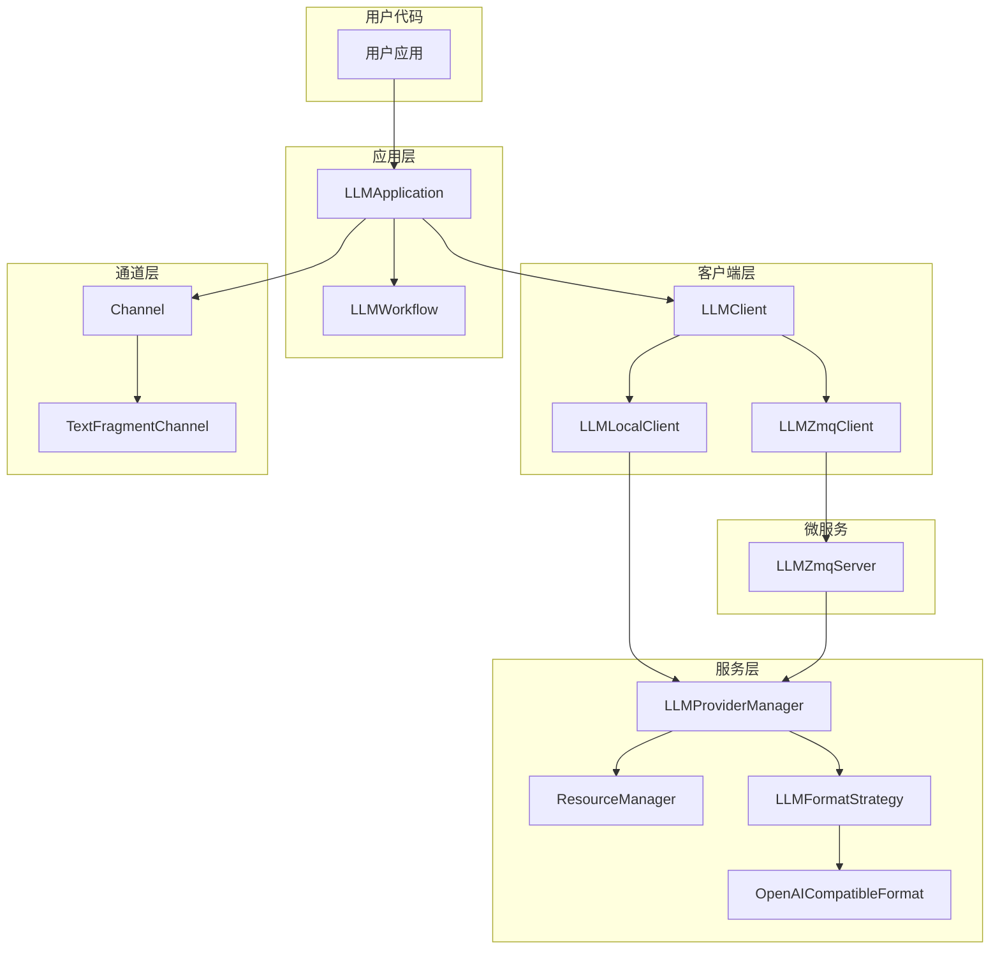
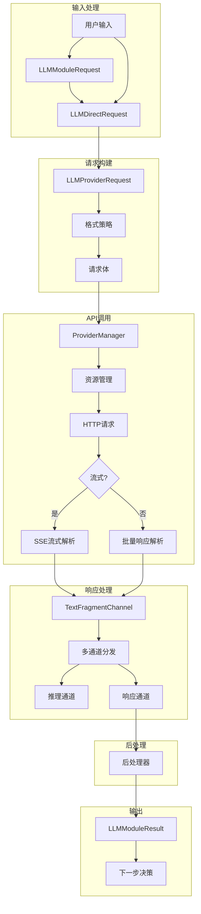
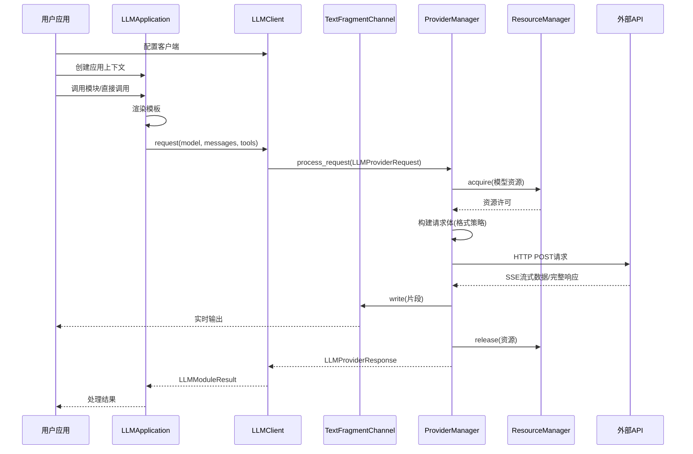

# 框架结构图表

## 类调用关系图

```mermaid
graph TB
    subgraph "用户代码"
        User[用户应用]
    end
    
    subgraph "应用层"
        App[LLMApplication]
        Workflow[LLMWorkflow]
    end
    
    subgraph "客户端层"
        Client[LLMClient]
        LocalClient[LLMLocalClient]
        ZmqClient[LLMZmqClient]
    end
    
    subgraph "微服务"
        ZmqServer[LLMZmqServer]
    end
    
    subgraph "服务层"
        ProviderManager[LLMProviderManager]
        ResourceMgr[ResourceManager]
        FormatStrategy[LLMFormatStrategy]
        OpenAIFormat[OpenAICompatibleFormat]
    end
    
    subgraph "通道层"
        Channel[Channel]
        TextFragmentChannel[TextFragmentChannel]
    end
    
    User --> App
    App --> Client
    App --> Channel
    App --> Workflow
    
    Client --> LocalClient
    Client --> ZmqClient
    LocalClient --> ProviderManager
    ZmqClient --> ZmqServer
    ZmqServer --> ProviderManager
    
    ProviderManager --> ResourceMgr
    ProviderManager --> FormatStrategy
    FormatStrategy --> OpenAIFormat
    
    Channel --> TextFragmentChannel
```

## 数据流图

```mermaid
flowchart TD
    subgraph "输入处理"
        USER[用户输入] --> TEMPLATE[LLMModuleRequest]
        TEMPLATE --> MESSAGES[LLMDirectRequest]
        USER --> MESSAGES
    end
    
    subgraph "请求构建"
        MESSAGES --> REQUEST[LLMProviderRequest]
        REQUEST --> FORMAT[格式策略]
        FORMAT --> REQ_BODY[请求体]
    end
    
    subgraph "API调用"
        REQ_BODY --> PROVIDER[ProviderManager]
        PROVIDER --> RESOURCE[资源管理]
        RESOURCE --> HTTP[HTTP请求]
        HTTP --> STREAM{流式?}
        
        STREAM -->|是| SSE[SSE流式解析]
        STREAM -->|否| BATCH[批量响应解析]
    end
    
    subgraph "响应处理"
        SSE --> CHANNEL[TextFragmentChannel]
        BATCH --> CHANNEL
        
        CHANNEL --> MULTI_CHANNEL[多通道分发]
        
        MULTI_CHANNEL --> REASONING[推理通道]
        MULTI_CHANNEL --> RESPONSE[响应通道]
    end
    
    subgraph "后处理"
        RESPONSE --> POSTPROCESS[后处理器]
    end
    
    subgraph "输出"
        POSTPROCESS --> RESULT[LLMModuleResult]
        RESULT --> NEXT[下一步决策]
    end
```

## 数据流时序图

```mermaid
sequenceDiagram
    participant User as 用户应用
    participant App as LLMApplication
    participant Client as LLMClient
    participant Channel as TextFragmentChannel
    participant Provider as ProviderManager
    participant Resource as ResourceManager
    participant API as 外部API
    
    User->>Client: 配置客户端
    User->>App: 创建应用上下文
    
    User->>App: 调用模块/直接调用
    
    App->>App: 渲染模板
    App->>Client: request(model, messages, tools)
    
    Client->>Provider: process_request(LLMProviderRequest)
    
    Provider->>Resource: acquire(模型资源)
    Resource-->>Provider: 资源许可
    
    Provider->>Provider: 构建请求体(格式策略)
    Provider->>API: HTTP POST请求
    
    API-->>Provider: SSE流式数据/完整响应
    Provider->>Channel: write(片段)
    Channel-->>User: 实时输出
    
    Provider->>Resource: release(资源)
    
    Provider-->>Client: LLMProviderResponse
    Client-->>App: LLMModuleResult
    App-->>User: 处理结果
```

